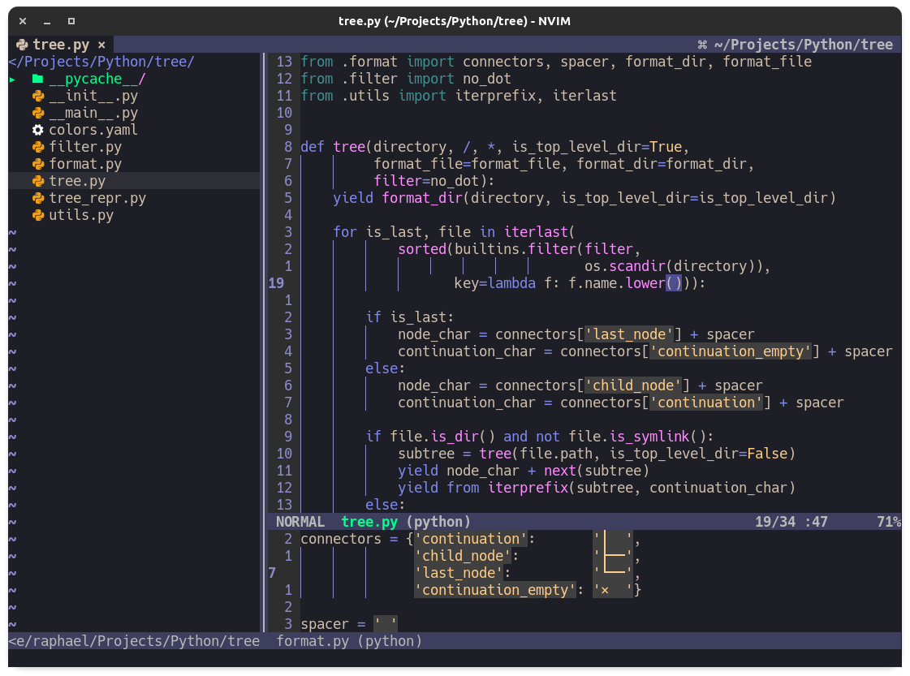

# Inkpot Refilled

Inkpot Refilled is a fork of the unmaintained inkpot theme by @ciaranm
aiming to "update" the colorscheme to today's vim and neovim features.

The main feature of this fork is to define guifg and guibg for every highlight group
even when using the terminal so the new 'termguicolors' option can be used.

## Customization
 * `g:inkpot_black_background`: set to 1 to use a black (#000000) background
